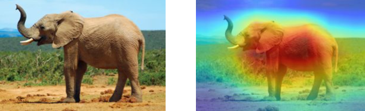
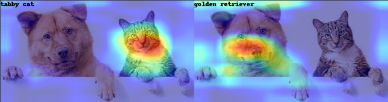
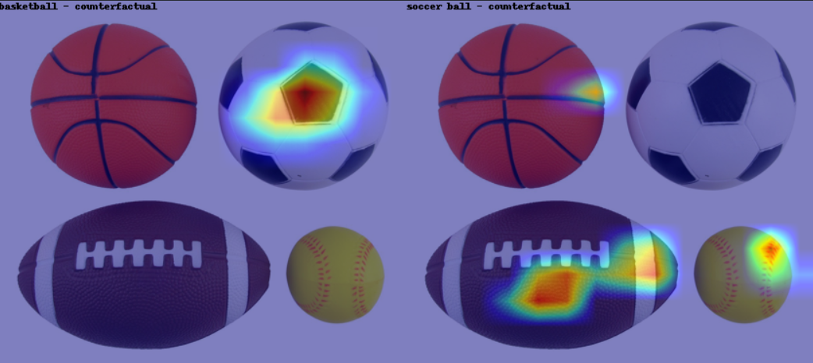
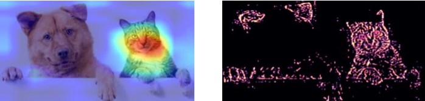

# Grad-CAM
## Statistical Methods in AI, Spring 2021

### About
Implementation based on the paper by [Selvaraju et al.](https://arxiv.org/pdf/1610.02391.pdf)

Pytorch implementation for Grad-CAM, using [pytorch hooks](https://pytorch.org/tutorials/beginner/former_torchies/nnft_tutorial.html), which enable us to access the individual gradients while backpropagation. The GradCAM implementation can look at the gradients flowing through any specified CNN layer in the model.

The implementation also includes extensions of GradCAM such as:
- Target Specific GradCAM
- Guided GradCAM
- Counterfactual Activation Map

### File Structure
`GradCam.py` contains the main implementation of the GradCAM and its extensions. The jupyter notebooks use modules imported from `GradCam.py`, and show how to use it.

### Results
- Base GradCAM

- Class Discriminative GradCAM

- Counterfactual​ Activation Mapping

- ​Guided GradCAM

